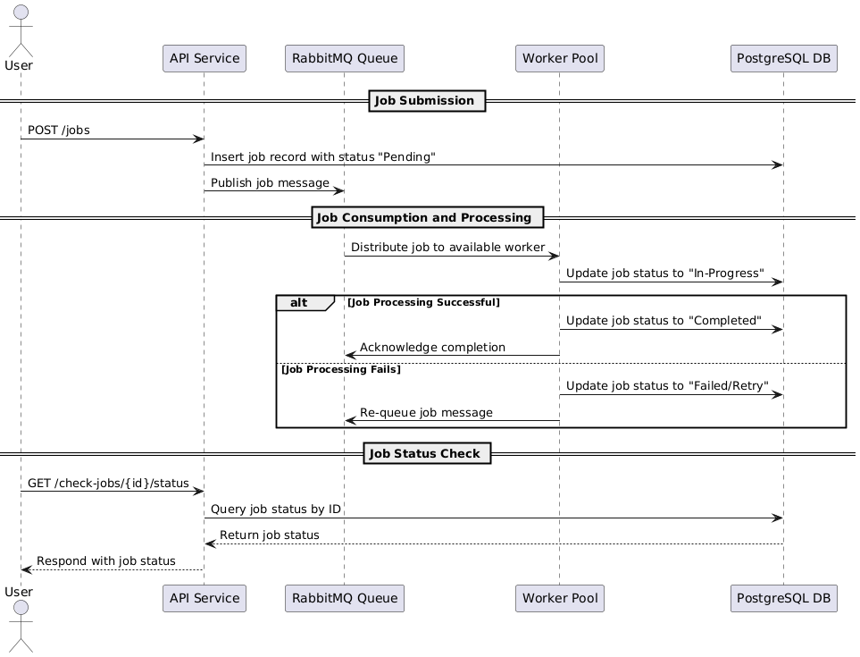
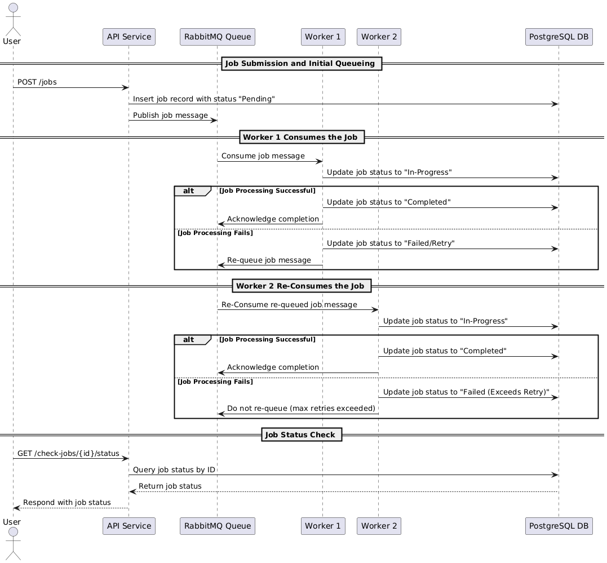

# Job-Queue-Simulation
Distributed job processing system built with Golang, RabbitMQ, and PostgreSQL. It’s designed to simulate and manage background job processing, allowing jobs to be queued, prioritized, retried upon failure, and tracked for completion status. This project showcases a simple but effective example of a job orchestration system, which is commonly used in distributed systems and microservices architecture.

# Features
- Job Queueing
- Job Retry
- Job Tracking
- Worker Pool

# Architecture Overview
In this sequence, we see the high-level process of job submission, queuing, consumption by the worker pool, and status checking.

## Detailed Worker Flow
In this sequence, we zoom into the worker’s role, showing how jobs are consumed, processed, and re-queued upon failure, with retries up to a specified limit.

# Endpoints
- Job Submit
Endpoint: `POST /jobs`
Description: Accepts a job payload and publishes it to the RabbitMQ queue. The job is saved in the PostgreSQL database with an initial status of `"Pending"`
- Job Status Check
Endpoint: `GET /check-jobs/{id}`
Description: Returns the current status of a job, allowing users to track progress or completion.

---
# Technologies Used

## RabbitMQ
RabbitMQ facilitates distributed processing by enabling multiple workers to consume jobs from the queue efficiently.

## PostgreSQL
PostgreSQL stores job metadata, including status, retries, and timestamps, ensuring data persistence and reliability.

## Golang
Golang powers the job processing system, encompassing the API server, worker pool, and job processing logic, providing high performance and concurrency.

